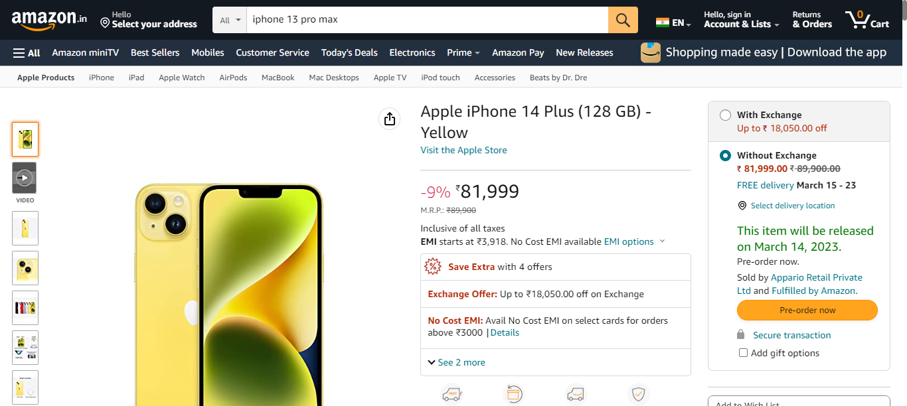

This is the sample project that I completed during my course at Qspider to become a Java QA Automation Engineer.Using knowledge gained throughout the course to develop a testing framework for a e-commerce(Amazon) application.

## Project Title:

An End to End Selenium Webdriver Project with Java for Automation Practice E-Commerce Website.This framework is related to registration , login , choice the product by different methods , add to cart and delete the product using data driven method for run.

## Technology Stack:

1.Programming language - Java

2.Build and project management tool - Maven

3.Testing framework - TestNg

4.Automation framework - Selenium WebDriver

5.Reporting framework - extent report

## Test Cases covered in this project:

✅1. Test Case - Automate User Registration process.

Steps to Automate:

   1.Open this url https://www.amazon.in/

   2.Click on sign In link.
   
   3.Enter your mobile number in Sign In section.

   4.Click on Continue.

   5.Error come [mobile number is not registered].

   6.click to sign In link and click to"Create your Amazon account" link. 
 
   7.Enter your Personal Information, Mobile number,   Contact info and Password.

   8.Click on Continue.

   9.Back to homepage.

##note: I use the invalid mobile number  but we can edit mobile number using commonamazondata.properties.txt.

✅2. Test Case - Automate 'Search Product' feature of the website.

Steps to Automate:
   
   1.Open this url https://www.amazon.in/

   2.Click on sign In link.
   
   3.Enter your mobile number in Sign In section.

   4.Click on Continue.

   5.Move your cursor over Search text box.

   6.Product 'Iphone 13 pro max' is searched.

   7.Click on Iphone of your choice.

   8.Click add to cart button and go to Cart.

   9.click on delete option.

   10.back to homepage.

✅3. Test Case - Automate 'Dropdown'and'Search Product' feature of the website.

Steps to Automate:

   1.Open this url https://www.amazon.in/

   2.Click on sign In link.

   3.Enter your mobile number in Sign In section.

   4.Click on Continue.

   5.Select the 'Electronics' from the dropdown list.

   6.Move your cursor over Search text box.

   7.Product 'lg tv' is searched.

   8.Click on lg tv of your choice.

   9.Click add to cart button and go to Cart.

  10.Delete both the product from the Cart. .

  11.back to homepage.

✅4. Test Case - Automate end-to-end "Buy Product" feature of the website.

Steps to Automate:

  1.Open this url https://www.amazon.in/

  2.Login to website.

  3.Click on Mobiles link option.

  4.Move your cursor over Laptops & Accessories text.

  5.Click on 'sandisk'.

  6.Click on sandisk pendrive of your choice.

  7.Click add to cart button and go to Cart.

  8.Delete the product from the Cart. .

  9.back to homepage.

✅5. Test Case - Automate end-to-end "Buy Product" feature of the website.

Steps to Automate:

1.Open this url https://www.amazon.in/

2.Login to website.

3.Click on Best Sellers link option.

4.Click on sub menu Clothing & Accessories.

5.Move your cursor over Men text.

6.Click on sub menu SHOES.

7.Click on 'Sandals & Floaters'

8.Click on Sandals & Floaters of your choice.

9.Click add to cart button and go to Cart.

10.Delete the product from the Cart. .

11.back to homepage.

 
   

## Documentation

[BATCHEXECUTION](amazonproject/BATCHEXECUTIONtestng.xml)

[CROSSBROWSEREXECUTION](amazonproject/CROSSBROWSERtestng.xml)

[GROUPEXECUTION](amazonproject/GROUPEXECUTIONtestng.xml)

[ItestListnerCLASS](amazonproject/ItestListnerAMZtestng.xml)

[LISTNERCLASS](amazonproject/LISTNERAMZtestng.xml)

[PARALLELEXECUTION](amazonproject/PARALLELexecutiontestng.xml)

[RegionalRegressionCLASS](amazonproject/RegionalRegressiontestng.xml)

[Extentreport](amazonproject/extentreport.html)

## Screenshots
Screenshots of failure testcases by LISTNERCLASS:

